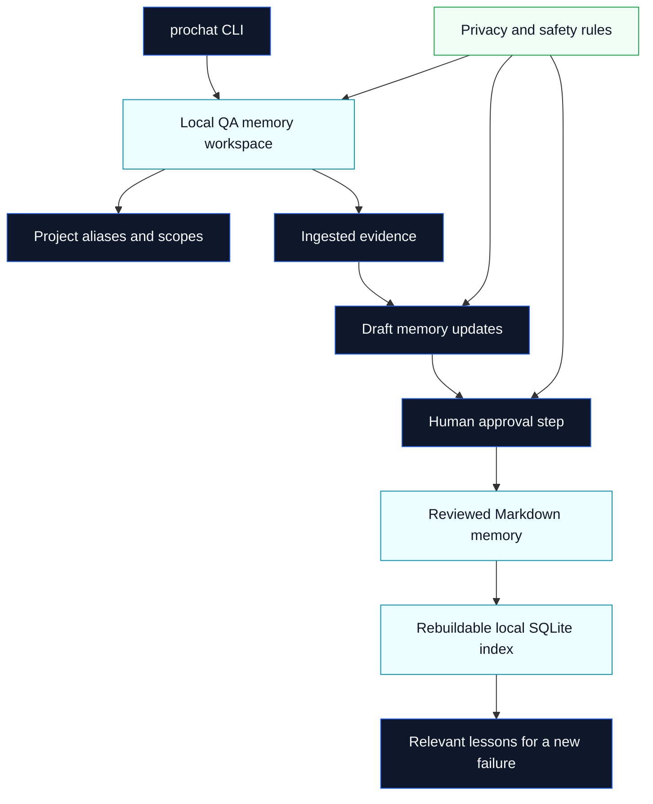

# ProChat Memory for QA

**Stop solving the same QA failure twice.**

A local-first QA memory system for capturing reusable evidence from recurring failures, CI investigations, and regression work.

ProChat Memory for QA is a local, source-available beta for QA testers and test teams that use AI during failed-test investigation. It helps testers capture reviewed lessons from failed tests, CI output, exploratory testing, manual QA, selector problems, test data issues, environment differences, root causes, fixes, and ruled-out hypotheses, then retrieve those lessons when a similar failure appears again.

It is not a test runner and it does not replace Playwright, Cypress, Selenium, Robot Framework, CI systems, Jira, TestRail, or tester judgment. It adds a local memory layer around the tools testers already use.

This repository is designed for three audiences:

- **QA recruiters and interviewers** who want to understand the practical QA problem this project solves;
- **technical reviewers** who want to inspect the architecture, source, safety boundaries, and release model;
- **approved beta testers** who want clear installation, usage, feedback, and licensing guidance.

## The problem

QA teams repeatedly investigate failures that look new but are actually variations of earlier problems:

- flaky UI tests caused by timing, selectors, or async rendering;
- failed Playwright, Cypress, Selenium, or Robot Framework checks;
- CI failures caused by environment, data, permissions, or configuration drift;
- recurring API or integration defects;
- manual regression findings that are hard to reuse later;
- investigation notes scattered across tickets, chats, logs, screenshots, and memory.

The result is wasted time: testers rediscover the same causes, repeat the same checks, and lose valuable context when projects, clients, tools, or team members change.

## The idea

ProChat Memory for QA turns reviewed investigation knowledge into reusable local QA memory.


The durable source of truth is Markdown. Local indexes are rebuildable. Reusable memory is approved only after human review.

## What testers can store

ProChat Memory for QA is meant for structured, reusable QA investigation knowledge such as:

- failure summaries and reproduction notes;
- selectors, locators, fixture names, test data patterns, and environment notes;
- observed behavior, expected behavior, and acceptance impact;
- likely causes and confirmed root causes;
- fixes, workarounds, retest notes, and release-risk observations;
- hypotheses that were investigated and ruled out;
- project-specific gotchas that should be remembered but not hard-coded into a test script.

## What beta testers gain

Approved beta testers can use this project to evaluate whether local QA memory helps them:

- reduce repeated investigation work;
- make AI-assisted QA more evidence-based and reviewable;
- keep useful test knowledge outside chat history and ticket noise;
- separate project and client knowledge with explicit scopes;
- preserve knowledge in readable Markdown instead of opaque databases;
- improve handover between manual testing, automation, CI, and release validation;
- explain recurring defects and regression risks more clearly to developers and product owners.

## How it works



The public beta snapshot includes the CLI, core runtime, source-based setup, installation docs, quick-start docs, privacy and safety guidance, troubleshooting, architecture notes, contribution guidance, security policy, trademark notice, changelog, version metadata, and the beta evaluation license.

MCP integration is not included in the public beta snapshot.

## Quick start from source

### Requirements

- Node.js `22.13.0` or newer;
- npm;
- an approved beta source snapshot;
- a local folder where QA memory may be stored.

Check versions:

```bash
node --version
npm --version
```

Install dependencies and build the public source snapshot:

```bash
npm install --ignore-scripts
npm run build
npm run quickstart
```

Run the CLI from the source checkout:

```bash
node packages/cli/dist/index.js --help
```

Initialize a local workspace:

```bash
node packages/cli/dist/index.js init ./qa-memory-workspace
```

Add a project alias:

```bash
node packages/cli/dist/index.js project add sample-project ./qa-memory-workspace
```

Ingest a sanitized failure note:

```bash
node packages/cli/dist/index.js ingest ./samples/failure.txt --project sample-project ./qa-memory-workspace
```

Retrieve relevant prior memory:

```bash
node packages/cli/dist/index.js retrieve --project sample-project --query "checkout subtotal mismatch" ./qa-memory-workspace
```

Create and review a draft before approval:

```bash
node packages/cli/dist/index.js draft create --from <ingestion-id> --project sample-project --title "Checkout subtotal mismatch" ./qa-memory-workspace
node packages/cli/dist/index.js approve <draft-id> ./qa-memory-workspace
```

Detailed setup is in [`docs/INSTALLATION.md`](docs/INSTALLATION.md) and [`docs/QUICKSTART.md`](docs/QUICKSTART.md).

## Safe workspace model

Keep the product source, memory workspace, and client project separate:

```text
qa-memory-system/
  memory-qa/               # public beta product source
  qa-memory-workspace/     # tester-owned local memory
  client-project/          # existing project or test suite
```

Do not put secrets, credentials, unsanitized client data, private production logs, confidential screenshots, private URLs, or real customer data into reusable memory or public feedback.

## What this repository demonstrates

For technical reviewers and interviewers, this repository demonstrates:

- practical QA problem analysis around recurring failures;
- test-context modeling and scope separation;
- source-available beta release discipline;
- local-first and review-first AI-assisted QA design;
- TypeScript CLI and core runtime implementation;
- Markdown/Git-friendly knowledge storage;
- privacy and safety boundaries for QA evidence;
- deterministic public export from a private canonical repository.

## Current beta status

ProChat Memory for QA `0.1.0-beta.1` is available to approved beta testers and approved business evaluators.

This is beta software. It is not production-ready, and no npm package is published.

The source is visible for evaluation, but it is not open source. Approved beta users may clone, inspect, build, run, and locally modify the beta for testing and evaluation in authorized environments under the [ProChat Memory for QA Beta Evaluation License](LICENSE.md).

## Beta tester expectations

During the beta, testers should focus on:

- whether the workflow matches real failed-test investigation;
- whether the memory format is understandable and useful later;
- whether retrieval helps with similar future failures;
- whether project and client boundaries are clear enough;
- whether installation and onboarding are easy enough;
- whether any safety, privacy, or licensing wording is unclear.

Public feedback should use GitHub Issues or GitHub Discussions when enabled. Submit only synthetic or thoroughly sanitized examples.

## Licensing summary

This repository is source-available for approved beta evaluation. It is not open source.

Approved beta users may clone, inspect, build, run, and locally modify this beta for testing and evaluation in authorized environments.

Approved beta users may not resell, redistribute, sublicense, publish mirrors or modified versions, offer it as a hosted service, embed it in another commercial product, or use it for production operations outside the beta evaluation without a separate written agreement from ProChat.

See [`LICENSE.md`](LICENSE.md) for the complete controlling beta evaluation terms.

## Release model

This public repository is generated from a separate private canonical development repository. Public snapshots are produced through a reviewed, allowlist-based export process. Private roadmaps, internal implementation plans, commercial material, tester records, real client data, private history, and MCP implementation code are not part of the public export.

Each generated public snapshot records the source commit, version, export timestamp, manifest, and validation evidence.

## Documentation

- [`docs/INSTALLATION.md`](docs/INSTALLATION.md) — source and approved-artifact setup;
- [`docs/QUICKSTART.md`](docs/QUICKSTART.md) — first end-to-end CLI workflow;
- [`docs/ARCHITECTURE.md`](docs/ARCHITECTURE.md) — local architecture and snapshot model;
- [`docs/PRIVACY-AND-SAFETY.md`](docs/PRIVACY-AND-SAFETY.md) — data boundaries and feedback rules;
- [`docs/TROUBLESHOOTING.md`](docs/TROUBLESHOOTING.md) — common setup and workflow issues;
- [`CONTRIBUTING.md`](CONTRIBUTING.md) — beta feedback and contribution policy;
- [`SECURITY.md`](SECURITY.md) — security reporting guidance;
- [`VERSION.md`](VERSION.md) — version and release metadata.

## Maintainer

Created and maintained by
[Steve Westhoek](https://github.com/stevewesthoek)
under the [ProChat organization](https://github.com/prochattools).
